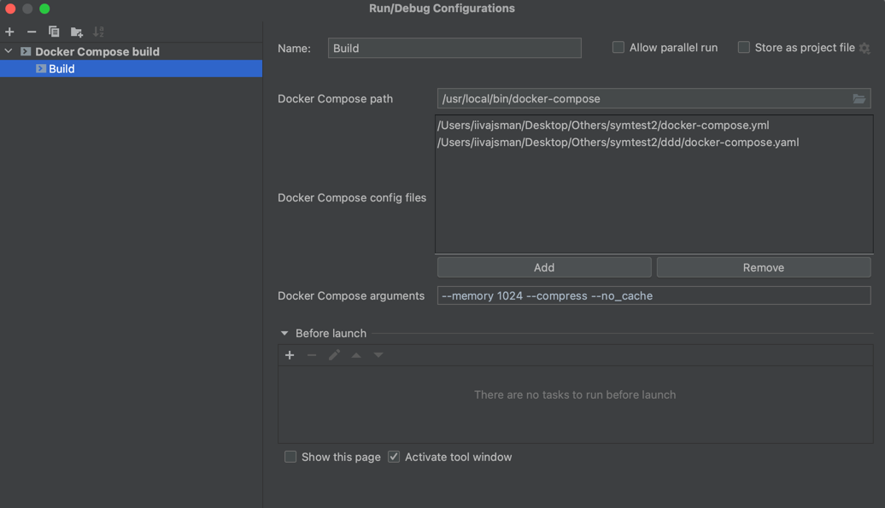

# Docker Compose Build Plugin for IntelliJ IDEA

This plugin allows you to easily build Docker Compose projects directly from your IntelliJ IDEA interface. It provides auto-completion for `docker-compose build` commands, validates Docker Compose paths and arguments, and more.

## Features

- Autocomplete for `docker-compose build` arguments.
- Validation of Docker Compose paths and arguments.
- Specify the path to the `docker-compose.yml` file.
- Ability to manage multiple Docker Compose configuration files.
- Validation of non-duplicate and existing Docker Compose files.
- Simple and user-friendly UI.
- Auto-complete docker-compose files from the project directory and subfolders.
- Validates commands to ensure that options that can only occur once are only met once.
- Easy navigation to add or remove Docker Compose files from the list.
- Alerts the user for duplicate files while adding them to the list.

## Getting Started

### Prerequisites

- [IntelliJ IDEA Community Edition](https://www.jetbrains.com/idea/download/ce/)
- [Kotlin Plugin for IntelliJ IDEA](https://plugins.jetbrains.com/plugin/6954-kotlin)
- [Docker Compose](https://docs.docker.com/compose/install/) installed on your system.

### Installation

1. In IntelliJ IDEA, go to `File` > `Settings` (on Windows/Linux) or `IntelliJ IDEA` > `Preferences` (on macOS).
2. Go to `Plugins`.
3. Click on `Install Plugin from Disk` and select the downloaded `.jar` file.
4. Restart IntelliJ IDEA.

### Usage

1. Once installed, go to `Run` > `Edit Configurations`.
2. Click on the `+` button and select `Docker Compose Build`.
3. Enter your Docker Compose path and any arguments you want to use.
4. Add or remove Docker Compose configuration files as needed.
5. Click `OK` and you're ready to go!

## Contributing

Contributions are very welcome! Please read the [contributing guide](CONTRIBUTING.md) to get started.

## License

This project is licensed under the MIT License. See the [LICENSE](LICENSE) file for more information.
